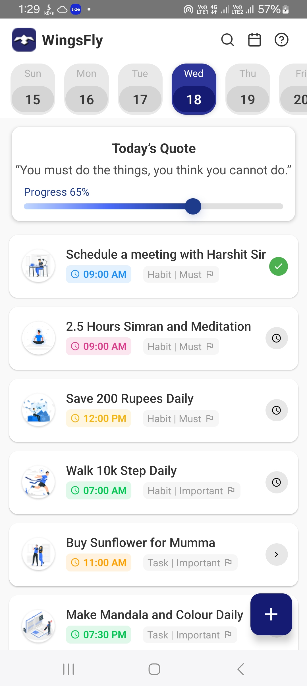
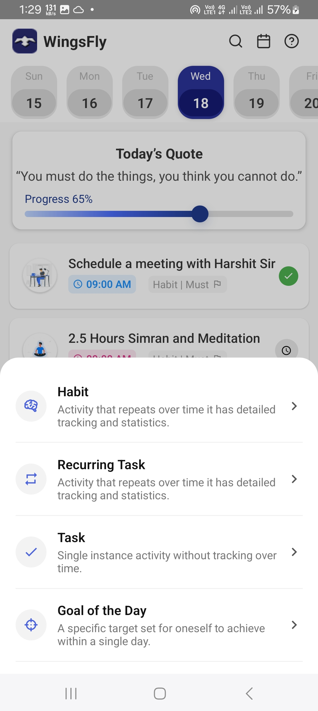

# 📝 Home Screen UI - React Native CLI Task

This project is a submission for the **Fresher Developer Test Task**. It replicates the **Home Screen** from the provided Figma design using **React Native CLI** (no Expo), focusing on modular structure, clean UI, smooth animations, and good development practices.

---

## ✅ Features Implemented

- ✅ Horizontal **Date Selector** (15–21) with highlighted selection
- ✅ “**Today’s Quote**” section with animated progress bar and thumb
- ✅ Scrollable **Task List** displaying:
  - Image/Icon
  - Title
  - Time with colored pill
  - Tags (e.g., Habit | Must)
  - Status icon (check, clock, or arrow)
- ✅ Floating “**+**” action button (FAB)
- ✅ Slide-up **Bottom Drawer Modal** with 4 action options:
  - Habit
  - Recurring Task
  - Task
  - Goal of the Day
- ✅ **Smooth drawer animation** using the `Animated` API

---

## 🧱 Folder Structure

```
/WingsFly
├── /src 
    ├── /assets                  
    ├── /components
    │   ├── DateSelector.tsx
    │   ├── QuoteSection.tsx
    │   ├── TaskItem.tsx
    │   ├── FloatingActionButton.tsx
    │   └── BottomDrawer.tsx
    ├── /screens
    │   └── HomeScreen.tsx
    └── App.tsx
├── Readme.md
```

---

## 📦 Setup Instructions

1. **Clone the repository**  
   git clone https://github.com/your-username/home-screen-task.git
   cd home-screen-task

2. **Install dependencies**  
   npm install

3. **Run on Android device/emulator**  
   npx react-native run-android

   Or on iOS (Mac only):
   npx react-native run-ios

> ⚠️ Ensure a device/emulator is running and your environment is properly set up for React Native CLI.

---

## 🧠 Key Decisions & Assumptions

- **React Native CLI** was used as per requirement.
- Used **TypeScript** for type safety and maintainability.
- All **design values were matched pixel-by-pixel** based on the Figma reference.
- Icons were loaded via `react-native-vector-icons` and task images via local assets.
- Used the **Animated API** for the drawer transition (no 3rd party like `react-native-reanimated`).
- No external theming library was added for dark mode (for simplicity) but can be added via `react-native-paper` or Context API.

---


## 📸 Screenshots

### 🏠 Home Screen



### ➕ Bottom Drawer



---

## 🤝 Author

- **Your Name**  
- [GitHub Profile](https://github.com/your-username)  
- Email: yourname@example.com

---

